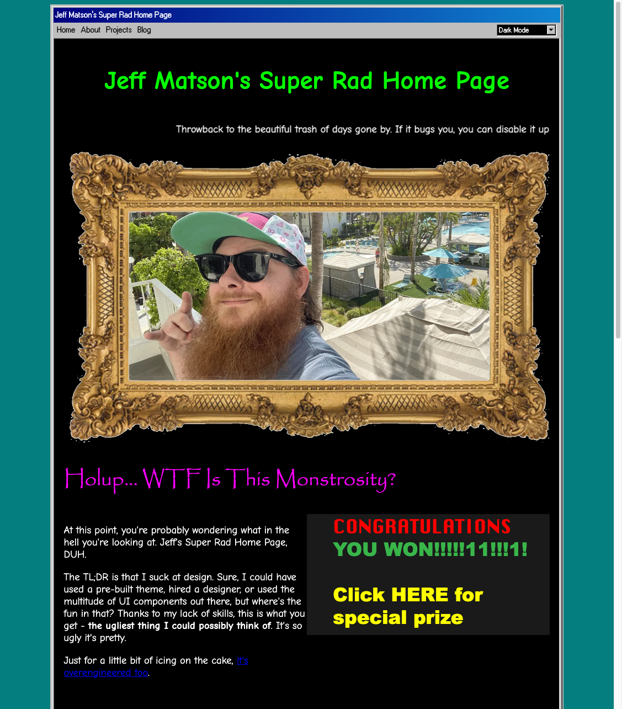
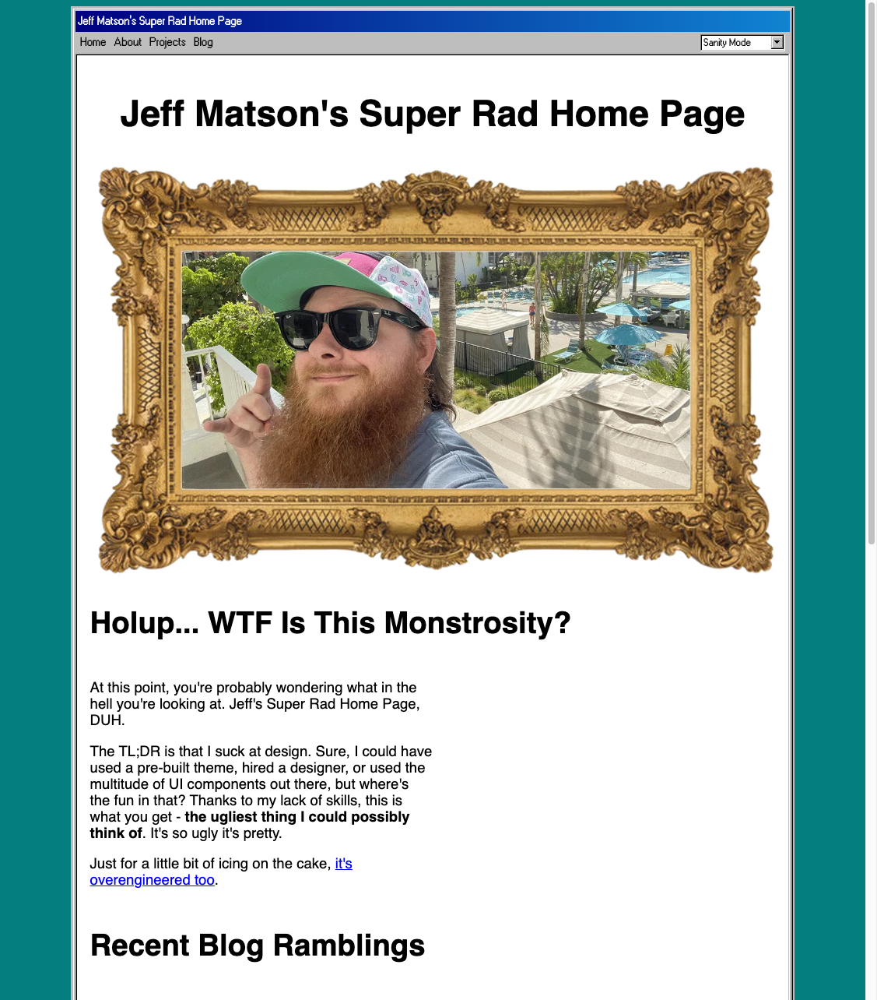

# Jeff's Ugly Website

Intentionally ugly. Unironically overengineered.

I suck at design. Sure, I could have used a pre-built theme, hired a designer, or used the multitude of UI components out there, but where's the fun in that? So instead I built the ugliest thing I could possibly think of.

Turns out there's a strange kind of beauty in truly ugly things — once you stop fighting it, the constraints just disappear.

When nothing has to look good, everything becomes an experiment. Overengineer the hell out of it. Try some absurd idea at 2 AM. If the train runs off the tracks, it adds value. The site is a playground disguised as a portfolio, and I'm having way more fun than anyone should building what is essentially a love letter to the beautiful trash of the early web.

**[jeffmatson.net](https://jeffmatson.net)** — GLHF.

| Dark Mode | Hot Dog Stand | Sanity Mode |
|---|---|---|
|  |  |  |

## What Even Is This?

A personal site wrapped in a fake Windows 95 browser window — beveled box shadows, gradient title bar, the works.

### The Aesthetic Crimes

- **Four fonts, zero cohesion.** Each one worse than the last.
    - Comic Neue: for maximum eye bleed
    - Papyrus: if it's good enough for Avatar, it's good enough for me
    - Tinos: because mixing serif and sans-serif is apparently "wrong" or whatever
    - Windows bitmap pixel font: the only one that kinda makes a little sense
- **A CSS `<marquee>`.** It's 2026 and I implemented a marquee. With `prefers-reduced-motion` support. You're welcome, accessibility team.
- **Multiple themes.** Something for everyone. Except people with taste.
    - Dark (default): because getting flashbanged by clicking a link crosses the line — even for me
    - Light: there are 2 kinds of people in this world: people who prefer dark mode and people who are wrong
    - [Hot Dog Stand](https://blog.codinghorror.com/a-tribute-to-the-windows-31-hot-dog-stand-color-scheme/): get dat dawg in you
    - Sanity Mode: for my a11y homies, corporate shills, and people who don't understand art
- **Banner ads.** They look totally legit. You should definitely click on them.

### The Overengineering

All of this is held together by the kind of dedication to detail that probably should've been applied to literally anything else.

- **TypeScript design tokens.** Compiled to CSS custom properties with `@layer` cascade control. If you're going to commit design crimes, you might as well have an alibi that compiles.
- **Zod-validated MDX frontmatter.** Type-safe blog posts, as God intended.
- **Vitest + Playwright.** Yes, there's a test suite. Unit tests _and_ E2E tests. For a site with Papyrus headings.
- **Nanostores.** localStorage-backed theme persistence so your Hot Dog Stand preference survives a page refresh.
- **React islands.** The fake popup ads are `client:only` components, because even garbage deserves a proper rendering strategy.
- **GitHub Actions CI → Cloudflare Pages.** Push to master, pray to nobody, ship to the edge.

Static site, no server runtime except when necessary. Thanks, [Astro](https://astro.build). The chaos is purely client-side — we had a vote and the server wants nothing to do with it.

## Wanna Run It?

Bold strategy. You'll need:
- [Node.js](https://nodejs.org/)
- [pnpm](https://pnpm.io/)

```bash
pnpm install
pnpm dev          # dev server
pnpm build        # production build -> dist/
pnpm test:run     # unit tests
pnpm test:e2e     # e2e tests (builds first)
pnpm lint         # check your work
```

## The Shape of Things

Nothing too wild in here. The real chaos is in what the code _does_, not how it's organized.

```
src/
  components/          # React islands and Astro components
  content/             # MDX blog posts and pages
  stores/              # theme + popup state
  styles/
    tokens.ts          # design token source of truth
    global.css         # the CSS crimes
  pages/               # file-based routing
scripts/               # build-time scripts
test/
  unit/                # Vitest
  e2e/                 # Playwright
```

## Contributing

Sure, go for it. Spot a typo? Fix it. Have a terrible idea that fits the vibe? Even better.

Open a PR and we'll see what happens. No promises I'll look at it anytime soon — or ever — but don't let that stop you. Just don't try to make it look nice.

## License

[GPL-3.0](LICENSE). Fork it, break it, make it worse. Credit is always appreciated — especially if your fork is total dogshit. I want my name on that.
